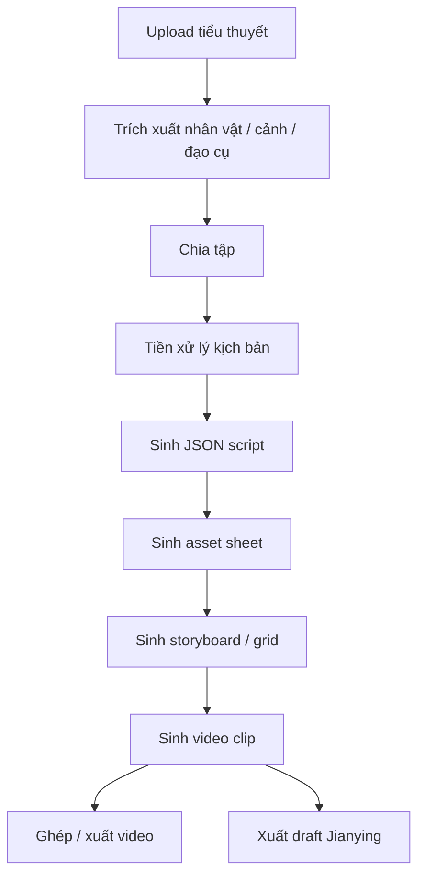
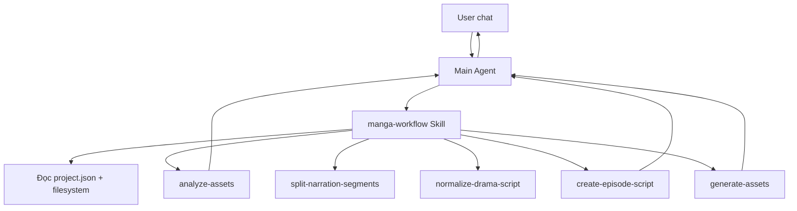
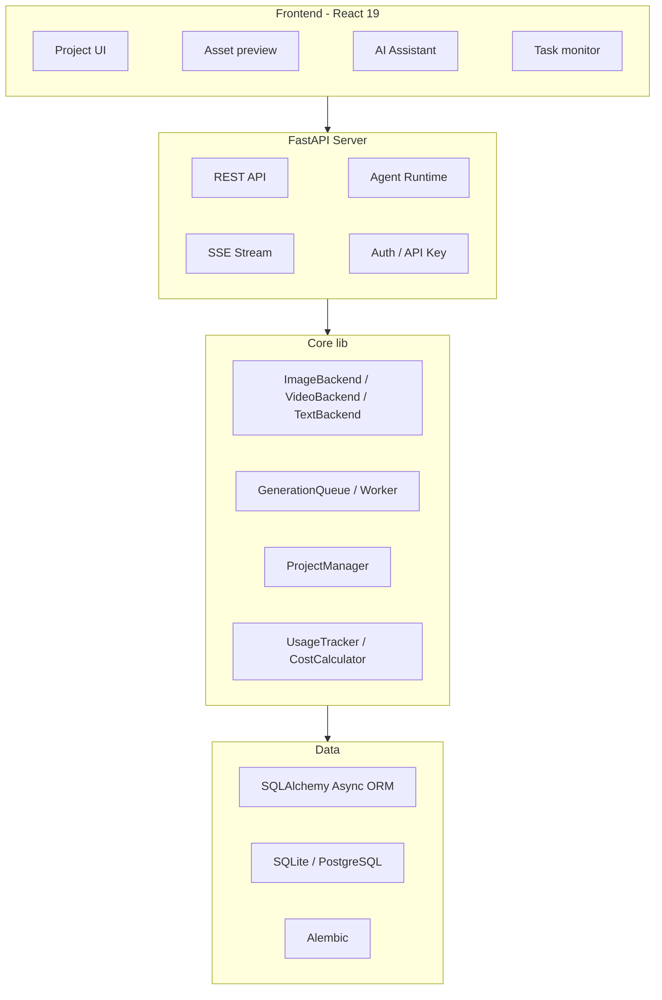

<h1 align="center">
  <br>
  <picture>
    <source media="(prefers-color-scheme: light)" srcset="frontend/public/android-chrome-maskable-512x512.png">
    <source media="(prefers-color-scheme: dark)" srcset="frontend/public/android-chrome-512x512.png">
    
  </picture>
  <br>
  ArcReel
  <br>
</h1>

> **Lưu ý:** Repo này có các tùy chỉnh riêng so với upstream.
> Xem [docs/custom-changes.md](docs/custom-changes.md) để biết chi tiết.

<h4 align="center">Nền tảng tạo video AI mã nguồn mở — biến tiểu thuyết thành video ngắn, vận hành bằng AI Agent.</h4>

<p align="center">
  <a href="README.md"></a>
  <a href="README.en.md"></a>
</p>

<p align="center">
  <a href="#khởi-động-nhanh"></a>
  <a href="https://github.com/ArcReel/ArcReel/blob/main/LICENSE"></a>
  <a href="https://github.com/ArcReel/ArcReel"></a>
  <a href="https://github.com/ArcReel/ArcReel/pkgs/container/arcreel"></a>
  <a href="https://github.com/ArcReel/ArcReel/actions/workflows/test.yml"></a>
</p>

<p align="center">
  
  
  
  
  
  
  
  
</p>

<p align="center">
  
</p>

---

## Giao tiếp với người dùng

- Khi giao tiếp trực tiếp với user trong repo này, AI assistant phải dùng **tiếng Việt**.
- Có thể giữ nguyên tên file, API, class, biến, command và thuật ngữ kỹ thuật bằng tiếng Anh khi cần chính xác.
- Nếu trích dẫn tài liệu/runtime prompt đang viết bằng ngôn ngữ khác, hãy tóm tắt lại bằng tiếng Việt.

## ArcReel là gì?

ArcReel là nền tảng tạo video AI cho workflow:

```text
Tiểu thuyết -> phân tập -> kịch bản JSON -> thiết kế nhân vật/cảnh/đạo cụ -> storyboard/grid -> video clip -> xuất thành phẩm
```

Kiến trúc chính:

```text
frontend/ React SPA  ->  server/ FastAPI  ->  lib/ core generation/runtime
```

ArcReel phù hợp cho người muốn biến nội dung truyện dài thành video ngắn theo từng tập, có quản lý project, asset, queue sinh ảnh/video, lịch sử phiên bản và AI assistant nội bộ.

---

## Năng lực chính

<table>
<tr>
<td width="20%" align="center">
<h3>🤖 AI Agent workflow</h3>
Claude Agent SDK + Skill + Subagent để điều phối từ phân tích truyện đến sinh video.
</td>
<td width="20%" align="center">
<h3>🎨 Sinh ảnh đa provider</h3>
Gemini, Volcengine Ark, Grok, OpenAI, Vidu và custom provider. Hỗ trợ character/scene/prop sheet để giữ nhất quán hình ảnh.
</td>
<td width="20%" align="center">
<h3>🎬 Sinh video đa provider</h3>
Hỗ trợ Veo, Seedance, Grok, Sora, Vidu và custom provider. Có thể cấu hình toàn cục hoặc theo project.
</td>
<td width="20%" align="center">
<h3>⚡ Queue bất đồng bộ</h3>
Image/video chạy theo lane riêng, giới hạn đồng thời theo provider, lease-based worker và hỗ trợ resume.
</td>
<td width="20%" align="center">
<h3>🖥️ Web workspace</h3>
Quản lý project, xem asset, rollback version, theo dõi task realtime và dùng AI assistant trong UI.
</td>
</tr>
</table>

## Workflow tổng quan



---

## Khởi động nhanh

> Khuyến nghị dùng Linux / macOS / WSL2 / Docker. Windows native có thể chạy workflow cơ bản, nhưng sandbox POSIX như `bwrap` sẽ tự degrade.

### Chạy bằng Docker mặc định SQLite

```bash
git clone https://github.com/ArcReel/ArcReel.git
cd ArcReel/deploy
cp .env.example .env
docker compose up -d
# Mở http://localhost:1241
```

### Chạy production PostgreSQL

```bash
cd ArcReel/deploy/production
cp .env.example .env    # nhớ đặt POSTGRES_PASSWORD
docker compose up -d
```

Sau khi chạy lần đầu:

1. Đăng nhập bằng user `admin`.
2. Mật khẩu lấy từ `AUTH_PASSWORD` trong `.env`; nếu chưa có, app sẽ tự tạo và ghi lại.
3. Vào `/settings` để cấu hình:
   - Provider cho ArcReel AI assistant.
   - API key/model cho sinh ảnh, sinh video, sinh text.
   - Custom provider nếu dùng OpenAI-compatible hoặc Google-compatible API.

Xem thêm: [docs/getting-started.md](docs/getting-started.md).

---

## Chạy dev local

### Backend

```bash
uv sync
uv run uvicorn server.app:app --reload --reload-dir server --reload-dir lib --port 1241
```

### Frontend

```bash
cd frontend
pnpm install
pnpm lint
pnpm check
pnpm build
```

### Test / lint backend

```bash
uv run python -m pytest
uv run ruff check .
uv run ruff format .
uv run basedpyright
```

---

## Mode nội dung và mode sinh video

ArcReel tách 2 khái niệm:

### `content_mode`

| Mode | Ý nghĩa | Script |
|---|---|---|
| `narration` | Nói sách/thuyết minh, chia theo nhịp đọc | `segments[]` |
| `drama` | Phim truyện hoạt hình, có scene/dialogue | `scenes[]` |

### `generation_mode`

| Mode | Ý nghĩa |
|---|---|
| `storyboard` | Sinh ảnh phân cảnh rồi dùng ảnh làm frame đầu cho video |
| `grid` | Sinh ảnh lưới, cắt thành frame đầu/cuối, rồi sinh video |
| `reference_video` | Dùng sheet ảnh character/scene/prop làm reference trực tiếp, bỏ qua storyboard |

Chi tiết workflow: [docs/state-machine-workflow.md](docs/state-machine-workflow.md).

---

## Tính năng nổi bật

- Pipeline đầy đủ từ truyện tới video thành phẩm.
- Agent orchestration bằng Skill + Subagent.
- Quản lý nhân vật/cảnh/đạo cụ ở project level và global asset library.
- Hỗ trợ style reference image để giữ style nhất quán.
- Version history và rollback asset/script.
- Queue sinh ảnh/video bất đồng bộ, có worker lease và per-provider concurrency.
- Theo dõi chi phí theo provider, currency và loại media.
- Ước tính chi phí trước khi generate.
- Xuất Jianying draft để biên tập tiếp.
- Multi API key cho từng provider.
- UI đa ngôn ngữ: `zh`, `en`, `vi`.
- Import/export toàn bộ project.

---

## Provider hỗ trợ

ArcReel dùng các abstraction chung:

- `ImageBackend`
- `VideoBackend`
- `TextBackend`

Có thể chọn provider ở global/project level.

### Image provider

| Provider | Ví dụ model | Ghi chú |
|---|---|---|
| Gemini / Google | Nano Banana, Imagen | Text-to-image, image-to-image, multi reference |
| Volcengine Ark | Seedream | Sinh ảnh theo model Ark |
| Grok / xAI | Grok Imagine Image | Text/image generation |
| OpenAI | GPT Image | Text-to-image, image edit |
| Vidu | Vidu Image | Image generation |
| Custom provider | OpenAI/Google compatible | Tự discover model qua API |

### Video provider

| Provider | Ví dụ model | Ghi chú |
|---|---|---|
| Gemini / Google | Veo | Text/image-to-video |
| Volcengine Ark | Seedance | Text/image-to-video |
| Grok / xAI | Grok Imagine Video | Video generation |
| OpenAI | Sora | Text/image-to-video |
| Vidu | Vidu Q-series | Hỗ trợ reference video workflow |
| Custom provider | OpenAI/Google compatible | Tự cấu hình endpoint/model |

### Text provider

| Provider | Ghi chú |
|---|---|
| Gemini | Script/overview/style text generation |
| Volcengine Ark | Structured text generation |
| Grok | Text generation |
| OpenAI | Text generation |
| Custom provider | OpenAI/Google compatible |

---

## AI assistant architecture

ArcReel assistant dựa trên Claude Agent SDK:



Nguyên tắc:

- Main Agent điều phối, không nhồi toàn bộ truyện vào context chính.
- Subagent làm việc nặng: phân tích nhân vật, chuẩn hóa script, chia segment/unit.
- Skill/tool xử lý phần deterministic: đọc/ghi file, gọi API, enqueue task.
- Sau mỗi phase, agent tóm tắt và hỏi user xác nhận trước khi chạy tiếp.

---

## Kiến trúc kỹ thuật



## Tech stack

| Lớp | Công nghệ |
|---|---|
| Frontend | React 19, TypeScript, Tailwind CSS 4, wouter, zustand, Framer Motion, Vite |
| Backend | FastAPI, Python 3.12+, uvicorn, Pydantic 2 |
| Agent | Claude Agent SDK, Skill, Subagent |
| Database | SQLAlchemy Async ORM, Alembic, SQLite, PostgreSQL |
| Media | FFmpeg, Pillow |
| Auth | JWT, API Key, Argon2 password hash |
| Deploy | Docker, Docker Compose |

---

## Tài liệu liên quan

- [Hướng dẫn sử dụng](docs/user-guide.md)
- [State machine workflow](docs/state-machine-workflow.md)
- [Custom changes so với upstream](docs/custom-changes.md)
- [Getting started](docs/getting-started.md)
- [Jianying export guide](docs/jianying-export-guide.md)

---

## Đóng góp

Mọi đóng góp, bug report và đề xuất tính năng đều được chào đón. Xem [CONTRIBUTING.md](CONTRIBUTING.md) để biết quy chuẩn dev/test.

Sau khi clone local, nên cài pre-commit:

```bash
uv run pre-commit install
```

Hook sẽ chạy ruff, frontend eslint và các kiểm tra bảo vệ workflow trước khi commit.

## License

[AGPL-3.0](LICENSE)

---

<p align="center">
  Nếu project hữu ích, hãy cho repo một ⭐ Star để ủng hộ nhé!
</p>
